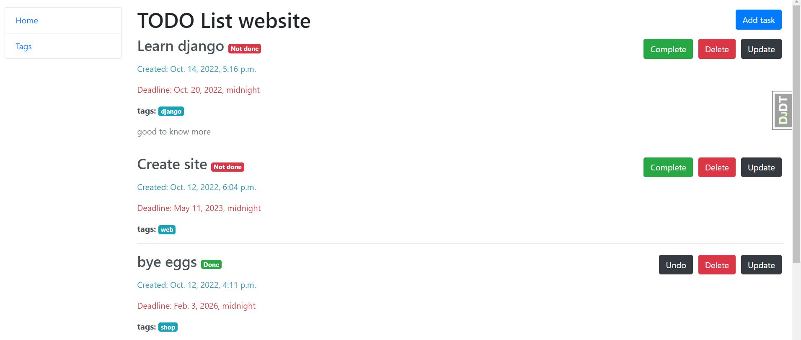

# TODO-list website

Django project to managing tasks. CRUD functionality with tasks.

## Installation

Python3 must be already installed

```shell
git clone https://github.com/AlexBOVUKR/todo-list
cd todo-list
python3 -m venv venv
source venv/bin/activate(Mac)
source venv/Scripts/activate(Windows)
pip install -r requirements.txt
python manage.py migrate
python manage.py runserver #starts Django server
```

## Features

* CRUD operations for task and tags

## Demo


